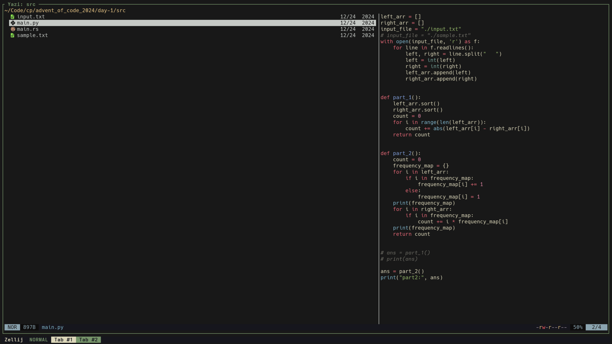

<div align="center">
  
</div>

<h3 align="center">
    Kanagawa Dragon Flavor for <a href="https://github.com/sxyazi/yazi">Yazi</a>
</h3>

## 👀 Preview



## 🎨 Installation

```bash
ya pkg add Raxen001/kanagawa-dragon
```

## ⚙️ Usage

Add these lines to your `theme.toml` configuration file to use it:

```toml
[flavor]
dark = "kanagawa-dragon"
```

## 📜 License

The flavor is MIT-licensed, and the included tmTheme is also MIT-licensed.

Check the [LICENSE](LICENSE) and [LICENSE-tmtheme](LICENSE-tmtheme) file for more details.

## CREDITS

- [marcosvnmelo/kanagawa-dragon.yazi](https://github.com/marcosvnmelo/kanagawa-dragon.yazi)
- [dangooddd/kanagawa.yazi](https://github.com/dangooddd/kanagawa.yazi)
